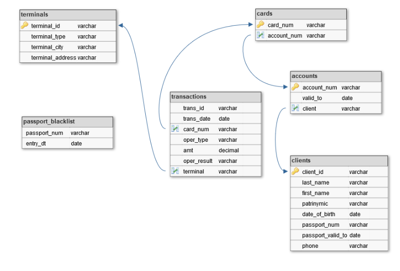

# ETL_process
ETL process based on Slowly Changing Dimension (SCD) MIPT (2021)

## Introduction

This project implements an example extract, transform, load (ETL) process that simulates a transfer layer 
with incremental change commit function (SCD) from OLTP systems to OLAP. 
The purpose of the work is a small simulation of a banking system with one DWH and a group of ATMs. The OLTP 
load is the source files ("flat files") with three types of data: a list of transactions, a list of ATMs, and 
a blacklist of passports. 
Server with installed and configured Oracle DBMS with a list of bank clients and their bank cards acts as OLAP. 
With the fixing of changes of OLTP load the search of bank fraud transactions takes place with the formation of 
the appropriate report. The fixing of changes and the formation of the report takes place every 
24 hours, a cron-file is written to implement this.

## Software Requirements

* Linux server with configured Oracle DBMS 
* Python 3.4+ with jaydebeapi

## How is it run?

To simulate bank operation, users must be pre-loaded on the DWH server to implement the following ER-model:

Everything else will do for you written script ETL process and generate a report on the server of fraudulent transactions

## Project Stages

The work of the script can be divided into several stages:
1. The jaydebeapi library is used to declare a cursor to connect to the database
2. A search for the minimum date of the source files takes place
3. Uploading source files to the server
4. Changes with the SCD mechanism are committed
5. A report is generated on the task: Transaction with an expired or blocked passport. (task 1)
6. A report is generated on the task: Transaction with an invalid contract. (task 2)
7. A report is generated on the task: Making transactions in different cities within one hour. (task 3)
8. A report is generated on the task: Attempting to match the amount. (task 4)
9. Moving the worked out files to the archive directory
10. Closing the database connection

## Structure of project

The structure of the project is shown below:

/archive                        : For worked files

/py_scripts:
* server_connection.py          : (Stage 1)
* find_early_date.py            : (Stage 2)
* load_data_from_terminals.py   : (Stage 3)
* load_transactions.py          : (Stage 3)
* load_blacklist.py             : (Stage 3)
* ETL_process.py                : (Stage 4)
* report_1.py                   : (Stage 5)
* report_2.py                   : (Stage 6)
* report_3.py                   : (Stage 7)
* report_4.py                   : (Stage 8)
* file_transfer.py              : (Stage 9)
* close_server_connection.py    : (Stage 10)
* DDL.py                        : Supporting script
* DROP_TABLE.py                 : Supporting script

/sql_scripts
* DDL_DWH.sql                   : SQL query to create tables
* DDL_REP_META.sql              : Inserting tables for source files
* DDL_STG.sql                   : Forming a staging table
* DROP_TABLE.sql                : Supporting DDL SQL query  
* INCREMENTAL.sql               : ETL process with SCD

=========================
* main.py                         : The main script
* main.cron                       : Task file for linux machine
* profiler.py                     : Script for profiling